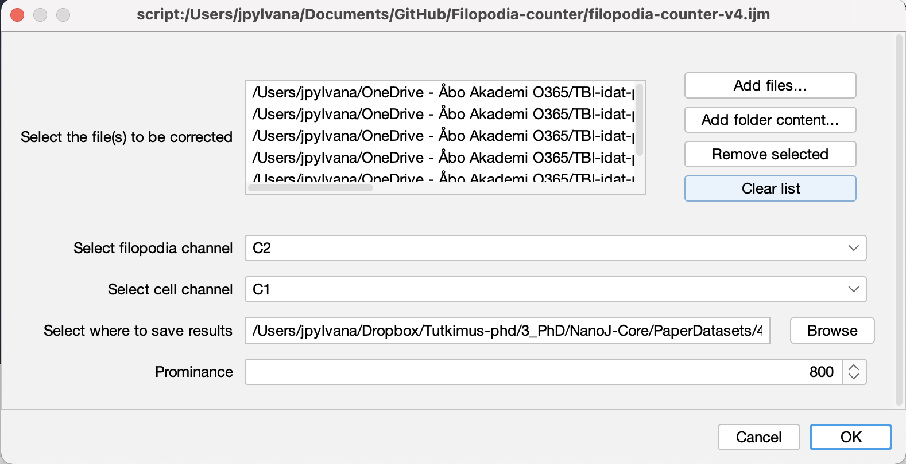
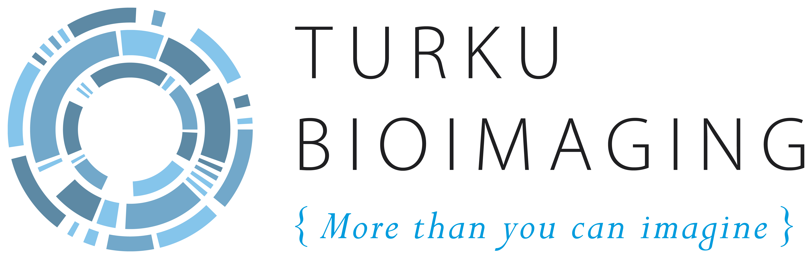

# Filopodia Counter

Filopodia Counter is a script for automated filopodia counting from single cell images. It expects a multichannel image (2-4 channels). The cell needs to be stainded at least with two markers, one that indicates filopodia tips and another that defines the cell area.

**Figure 1:** Example image for filopodia counter. In the image the cell body had been detected using an actin dye (white) and the every filopodia tip has been detected by staining myosin 10 (magenta).

## Dependences

Filopodia counter in dependent on Fiji-plugins MorpholibJ and BioFormats. Please subscribe to these using through the Fiji updater.

## Usage

**Figure 2:** User interface of the Filopodia counter

1. Download the Filopodia counter from this repository (see log for the current version) and drag of drop it to Fiji.
2. Add files to be corrected. You can cound filopodia in just one image or add multiple images. All these images will be processed with teh same parameters.
3. Select the channel with the filopodia stain (options C1, C2, C3, C4).
4. Select the channel with the cell body stain (options C1, C2, C3, C4).
5. Select the path to results folder.
6. Select promiance (= signal relative to the local background). Higher prominance detects less filopodia tips.
7. Click _OK_

The script will output

- .cvs table containing the name of each processed file
- Quality control image of each processed image

**Figure 3:** Filopodia counter saves a QC image of each quatified cell. This image has each counted filopodia circled in yellow.

## Changelog

Current version: _Filopodia-counter-v4_

## Turku BioImaging

This plugin is part of the Bioimage Analysis Toolbox created by [Turku BioImaging](https://bioimaging.fi), a broad-based, interdisciplinary science and infrastructure umbrella that aims to unite bioimaging expertise in Turku and elsewhere in Finland. Turku BioImaging is jointly operated by the [University of Turku](https://utu.fi) and [Åbo Akademi University](https://abo.fi).

For more information and support, email [image-data@bioimaging.fi](mailto:image-data@bioimaging.fi)

    

